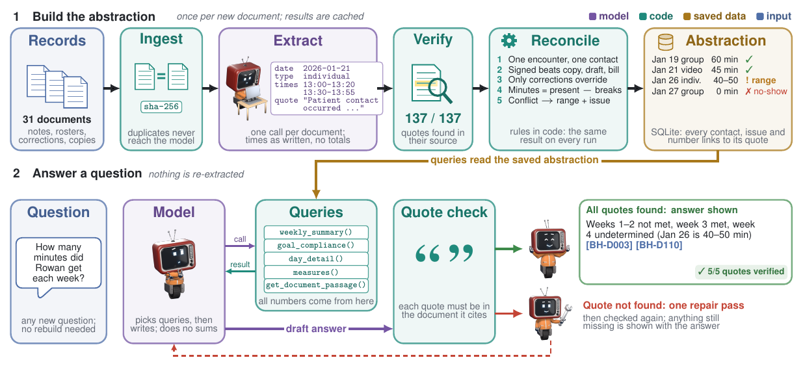
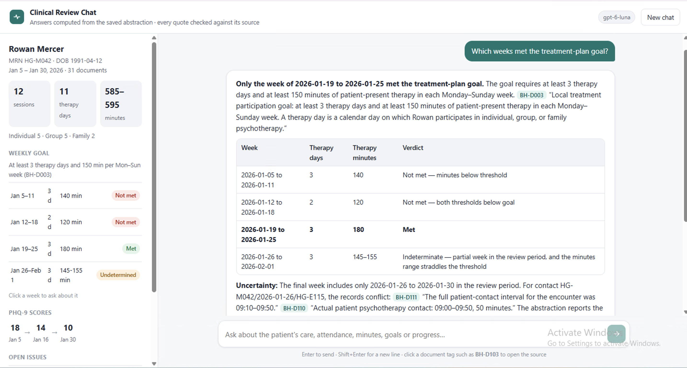

# Clinical abstraction prototype

Reads the supplied behavioral-health records, builds an auditable abstraction of each patient's care in
SQLite, and answers questions from it. **The model reads and writes; code decides and counts.**



*The robot marks model steps; everything else is plain code. Figure source: `docs/figure/method.tex`.*

The system runs on `gpt-6-luna` through the OpenAI API. As a comparison, the same pipeline was also run with a
small open model on a local GPU (`qwen3.5:9b` through Ollama). It reached identical results; see
[Closed vs local model](#closed-vs-local-model). The instructions below are for the GPT version, which is the one
to run.

## Quick start

Needs **Python 3.10+**. The commands are the same on Windows and macOS once the virtual environment is
active; only the setup lines differ.

**1. Install**

Windows (PowerShell):
```powershell
python -m venv .venv
.venv\Scripts\Activate.ps1
pip install -r requirements.txt
```

macOS / Linux (Terminal):
```bash
python3 -m venv .venv
source .venv/bin/activate
pip install -r requirements.txt
```

**2. Add your OpenAI key** in one of three ways. The key is never stored in the repo.

| | Windows (PowerShell) | macOS / Linux |
|---|---|---|
| Key in the environment | `$env:OPENAI_API_KEY="sk-..."` | `export OPENAI_API_KEY=sk-...` |
| Key in a file elsewhere | `$env:OPENAI_KEY_FILE="C:\path\key.txt"` | `export OPENAI_KEY_FILE=~/path/key.txt` |
| `.env` file in this folder | copy `.env.example` to `.env` and fill it in | same |

**3. Use the saved abstraction**

The abstraction of the 31 supplied documents is already built and included (`outputs/closed/abstraction.db`),
along with the answers to the five development questions (`outputs/closed/answers/`). Nothing needs to be
processed first.

Ask new questions (needs the key; the saved abstraction is read, never rebuilt):

```bash
python cli.py ask "How many group minutes did Rowan get in the week of Jan 19?"
python web/server.py --open                # the same, as a browser chat at http://127.0.0.1:8000
python cli.py answer-file                  # re-answer data/questions.json -> outputs/closed/answers/
```

Inspect the abstraction (no key needed):

```bash
python cli.py show contacts                # one row per reconciled contact, with inclusion decision and minutes
python cli.py show weeks                   # weekly days / minutes / hours
python cli.py show goal                    # weekly verdict vs the treatment-plan goal
python cli.py show counts | issues | measures | patients
python cli.py show day --date 2026-01-19   # every source record behind one day
```

**4. Process new documents**

Drop new files into `data/documents/` (or pass `--docs DIR`) and run:

```bash
python cli.py process                      # extracts only unseen documents, re-reconciles affected patients
```

Documents already in the abstraction are skipped (re-running `process` on the supplied set makes 0 model
calls), and duplicate copies are detected by fingerprint and never change a number. To rebuild everything from
scratch, delete `outputs/closed/abstraction.db` first (about 40 s and $0.02). `python scripts/benchmark.py`
measures that cold run in a separate scratch database, without touching the saved one.

The browser chat (`web/`, standard library only, screenshot at the end) shows the patient summary from the
abstraction and answers questions through the same pipeline as `cli.py ask`. Each answer shows its quote check,
cost and the queries it used. Clicking a document tag such as **BH-D103** opens the source with the quoted
passages highlighted.

## What is where

| Path | Contents |
|---|---|
| `SOLUTION.md` | Detailed write-up: design, rules, every contact, results, checks, both backends, cost. |
| `PERFORMANCE.md` | Detailed measurements for both backends. |
| `outputs/closed/` (GPT, the main results), `outputs/open/` (local model, for comparison) | Each has `abstraction.db` (SQLite), `abstraction.json` and `contacts.csv` (exports), `answers/` (DEV-01–05 plus unseen NEW-01–03, each with its quote check and tool calls), `benchmark.md` / `.json`. |
| `outputs/comparison.md` | Local vs closed abstraction, contact by contact. |
| `logs/<closed|open>/llm_calls.jsonl` | Every model call: step, model, latency, tokens. The `runs` table in each DB logs every process/ask run. |
| `backbone/` | `ingest` → `extract` (+ `schema`, `prompts`) → `verify` → `reconcile` → `queries` → `ask`. Backends: `llm_openai.py`, `llm_ollama.py`, chosen in `config.py`. |
| `web/` | Browser chat (GPT backend). |
| `scripts/` | `benchmark.py`, `compare_backends.py`, `compare_think.py` (thinking on/off test), `check_model.py` (lists the models your key can use). |
| `docs/` | The method figure and its TikZ source (`docs/figure/build.ps1` on Windows, `build.sh` on macOS). |

## The abstraction

The abstraction lives in a single SQLite file and is built in three layers, where every fact keeps the document
it came from, a verbatim quote, and that quote's exact position in the source. The first layer is the documents
themselves, fingerprinted by content so a duplicate copy is caught before it ever reaches the model. The second is
what the model extracts—one row per claim, covering service records (no-shows and cancellations included),
corrections, plan goals, PHQ-9 scores and clinical observations—where I made the model report times exactly as
written and never add them up, and code then checks that every quote really exists in the source. The third layer
is where the actual decisions happen, all in plain code: records about the same encounter merge into one contact,
signed records outrank schedule exports and copies, and a draft or a billing entry can never prove that care took
place. A later document only overrides an earlier one through an explicit correction, and only for the field it
names. Minutes are patient-present time minus documented breaks, and when signed records genuinely disagree, the
contact keeps a range and an open issue rather than a guess. None of the rules mention Rowan, dates or document
IDs—they're about document types—and the full list is in SOLUTION.md section 3.4.

## Results on the development questions

| | Result (both backends) |
|---|---|
| Sessions (Jan 5–30) | 12 attended: 5 individual, 5 group, 2 family; 11 distinct days |
| Minutes | 585–595 (9.75–9.92 h). Weeks: 140 · 120 · 180 · 145–155 |
| Goal (≥3 days and ≥150 min per week) | Week 1 not met (minutes), week 2 not met (both), week 3 met, week 4 **cannot be determined** |
| The one open conflict | Jan 26 individual session: two signed final notes give 09:00–09:50 (50 min) and 09:10–09:50 (40 min). It decides week 4. |
| Jan 19 | 2 contacts, 90 min: group 10:00–11:15 per correction BH-D103, minus 15-min break = 60; individual 30 |
| Jan 21 | 1 contact, 45 min: one video encounter, two connections, 10-min drop excluded |
| PHQ-9 | 3 distinct administrations: 18 → 14 → 10. The Jan 26 import (BH-D014) is a copy of the Jan 16 form, not a new assessment |
| Not counted | Jan 8 no-show, Jan 15 clinic cancellation, Jan 27 no-show despite an unsigned template note and posted charge, Jan 28 patient cancellation, medication visits, partner-only collateral, care coordination |

Full answers with quotes: `outputs/closed/answers/` and `outputs/open/answers/`.

## Design decisions tested

The decision I learned the most from was checking citations in code. Since every number comes from the query
functions, I expected the answers to be trustworthy once the arithmetic was right—but in the first full run, 3 of
94 quotations weren't actually in the source. Two were paraphrases dressed up as quotes, and one carried a real
factual error: it called BH-D104 a copy of the *final* roster when it's a resent copy of the *original,
uncorrected* one, which is exactly the distinction that decides whether the Jan 19 correction holds. So now code
re-locates every quotation in the document it cites, gives the model one repair pass on a miss, and prints the
result under the answer. With that in place, every quotation verified across two full benchmark runs (103/103 and
74/74). What this taught me is that grounding a model in tool outputs isn't enough on its own—the errors simply
move from the numbers into the wording around them, so the quotes need checking too.

I also tested whether letting the local model "think" before extracting would help. On four hard documents it was
about 4× slower, fixed one document, left the important errors in place and got stuck in a loop on another, so
thinking stays off for extraction and on for answering, where choosing the right tools does benefit from planning.

## Observed limitation

The limitation that worried me most is questions that assume something the record doesn't contain. When I asked
how care changed "before and after a treatment-plan change," the system invented one—it treated the plan's signing
on Jan 5 as the change and produced a confident before/after table, even though the record has only one plan
version. I fixed that case by making `plan_change_comparison` refuse when no second version exists and telling the
model to say plainly when a premise is missing, but the underlying tendency to bend events to fit a question can
still show up elsewhere. To investigate it properly, I'd write a set of false-premise questions—a plan change, a
second patient, a scale that was never given, a session on an empty date—run them on both backends, and measure how
often an answer claims something the abstraction doesn't hold. Then I'd test whether a
`what_does_the_record_contain` tool, called before answering, brings that rate down. One smaller judgement I made
on purpose: for the Jan 26 conflict the system reports 40–50 minutes instead of picking a winner, because neither
note corrects the other.

## Scaling to 500K–1M documents (estimates, not measured)

I expect the first bottleneck at a million documents to be extraction, in `extract.run_extraction`, which makes one
model call per document at roughly 2.5K input and 1K output tokens. For the GPT version that comes to about 2.5B
input and 1B output tokens—around **$730** at the standard price ($365 for 500K documents), or half that through the
Batch API—and about 14 days at the current 8-way concurrency, so API rate limits end up setting the pace. The local
model would need roughly 500 days on a single RTX 2080 Ti, so it only becomes realistic with more GPUs and a batching
server like vLLM. Either way, I'd route simple structured documents like rosters, exports and billing to a cheaper
model or a template parser, and keep the static prompt first so prompt caching applies. The good news is that daily
arrivals stay cheap, since only unseen fingerprints get extracted and only the affected patient is re-reconciled,
which takes milliseconds.

After extraction, the next pressure point is answering: `ask.answer` puts the patient list into the prompt, and the
collection-wide tools recompute every patient on the fly, which would take about 6 minutes at 100K patients. I'd
materialise a per-patient weekly table at reconcile time and have the tools return aggregates with paginated IDs.
Beyond that, ingest re-hashes every file on each run instead of indexing by path, size and modification time,
keyword search scans all text instead of using SQLite FTS5, and SQLite's single writer would have to become Postgres
once several workers write at once.

## Closed vs local model

Out of curiosity, I also ran the exact same pipeline on a small open model—`qwen3.5:9b` running locally through
Ollama on an RTX 2080 Ti—to see how much of the result depends on the model and how much on the code. It ended up
matching GPT on every headline number and on all 20 encounter contacts (`outputs/comparison.md`), but it didn't start
there: the first run got only 13 of 20 right and marked almost every week as "met," because the 9B model logged
narrative goals like "continue the plan" as treatment goals and copied scheduled times into notes as if they were
real attendance. General safeguards in code, clearer extraction rules and a retry when the model got stuck repeating
itself brought it to 20/20, and re-running GPT's cached extractions through the same final rules changed nothing.
What still differs is the writing—the local answers repeat some of the small model's labelling mistakes, even though
the numbers stay right because code computes them. Its saved results are in `outputs/open/`, and the full story is
in SOLUTION.md section 8.

## Performance (measured)

How the two compare on the 31 supplied documents and the 8 benchmark questions:

| | Local 9B | GPT-6 Luna |
|---|---|---|
| Processing all 31 documents | 22.6 minutes | 35–40 seconds |
| Typical question | 45–63 seconds | 25–29 seconds |
| Answer quotes verified | 40 of 47 | all of them |
| Cost | $0 | about $0.04 per full run |

Both give the same headline results; the difference is speed and how faithfully the answers quote their sources.
The detailed measurements—cold and warm runs, restarts, code-only queries, token counts and sizes—are in
[PERFORMANCE.md](PERFORMANCE.md), and the raw benchmark output is in `outputs/closed/benchmark.md` and
`outputs/open/benchmark.md`.

## Models, settings, assistance

- **`openai`:** `gpt-6-luna` through the Responses API. Extraction uses strict JSON-schema output,
  `reasoning.effort = low` and 8 parallel workers; prompt version `extract-v1`. Answering uses function tools with
  `reasoning.effort = medium`, and the repair pass uses `low`. Prices are `gpt-6-luna` standard tier from OpenAI's
  pricing docs (checked 2026-10-05): $0.10 per 1M input tokens, $0.01 cached input, $0.50 output; the Batch API is
  half. They are defaults in `backbone/config.py` and can be overridden with environment variables.
- **`ollama`:** `qwen3.5:9b` (Q4_K_M) through Ollama 0.35. JSON-schema output is enforced by Ollama's constrained
  decoding. Temperature 0, context 32K tokens, output capped at 12K, one request at a time. Extraction runs with
  thinking off and the extra local-model rules (prompt version `extract-v2-local`), and retries truncated JSON at
  temperature 0.3, then 0.6. Answering runs with thinking on, and tool results are cut at 24K characters so a
  prompt never overflows the context window.
- **Coding assistance:** Claude Code (Claude Opus 5.5, `claude-opus-5-5`) wrote the code with me; 
  I first understood the task, read a few documents, and then worte Rough_idea.txt and then worked with claude to form the full Plan.md, and then it coded the thing up, with my comments and steering., also checked the 
  design and reviewed the outputs against the source documents.
- **Runtime and cost:** see Performance and PERFORMANCE.md. All closed-model development work, about 300 model calls, cost about $0.17.

## Incomplete work and trade-offs

- Patient identity is the printed MRN. There is no cross-MRN matching for typos or merged charts.
- Reconciliation rules were written against this document set, and the local-model safeguards were validated only
  on these 31 documents. A fair test would run both backends on fresh documents.
- Answers are generated per question with no answer cache; the abstraction, not the answer, is the reusable unit.
- The SQLite file keeps a copy of each document's text so quotes can be looked up. At scale, the text would live
  in object storage instead.

## Browser chat

`python web/server.py --open` serves this page at http://127.0.0.1:8000. It answers with the GPT backend from the
saved abstraction, shows the quote check under each answer, and opens the cited source when a document tag is clicked.


